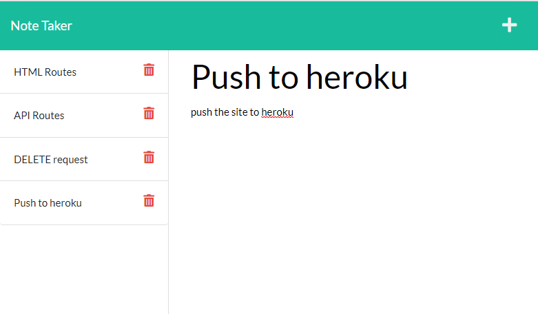

# express note taker
[](#) [](#) [](#)

### **Table of Contents**

- [Description](#description)
- [built with](#built-with)
- [Dependencies](#dependencies)
- [Install Instructions](#install-instructions)
- [Built By](#built-by)


## Description



an application that allows you to store and retrieve notes from a back-end JSON db.

### deployed link:
https://tranquil-meadow-03693.herokuapp.com/

## Built with 
- HTML
- CSS
- JS
- node.js

## Dependencies 
- express.js 
- uniqid 

## Install Instructions 
To install this application for local development, use the following command to install the local dependencies:

```bash
npm install
```

Once installation is done, use the following command:

```bash
# Open the application at http://localhost:3000 in your brower
npm start
```

### Built by 
Chris Manfredi